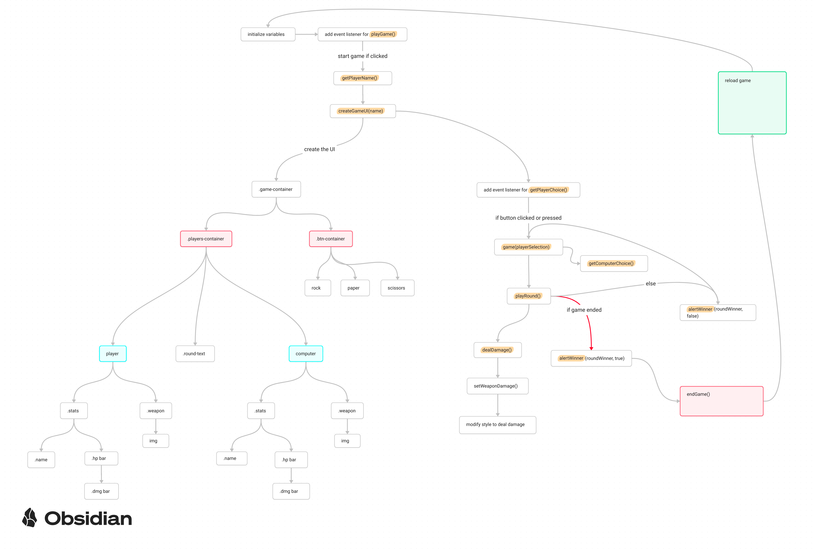

# rock-paper-scissors - [Live Preview](https://porobertdev.github.io/rock-paper-scissors/)

## About

This project is part of [TheOdinProject](https://www.theodinproject.com/https://github.com/TheOdinProject) curriculum. The curriculum had two parts for this game. The [first part](https://www.theodinproject.com/lessons/foundations-rock-paper-scissorshttps:/) was about getting the game to work with no UI, and the [second part](https://www.theodinproject.com/lessons/foundations-revisiting-rock-paper-scissorshttps:/) about adding UI. Therefore, the branch `no-ui` contains the code for the first part. Most of the code found in that branch has been rewritten.

I've made a [Figma mockup](https://www.figma.com/file/nVuZEeINzjXhGcLBeipd7m/Rock-Paper-Scissors-Game?type=design&node-id=4%3A9&mode=design&t=x3wXvX6SX5hafbav-1https:/) that I used as a starting point, but it was adjusted while coding. The color palette was choosen with a tool that generates colors, and the images were manipulated using Inkscape (extracting each image from `.eps` and rotating them).

## Features

* fully playable with keyboard only
* custom player name
* stunning animations for the winner =)

## Technologies used

* HTML5
* CSS3
* JavaScript

## Tools used

* git
* Figma
* Inkscape
* coolors.co

## Flowchart

  
Image

  
  
  

## Credits

* 'royce nicdao' from [vecteezy](https://www.vecteezy.com/vector-art/3027816-rock-paper-scissors-hand-gesture) for the images